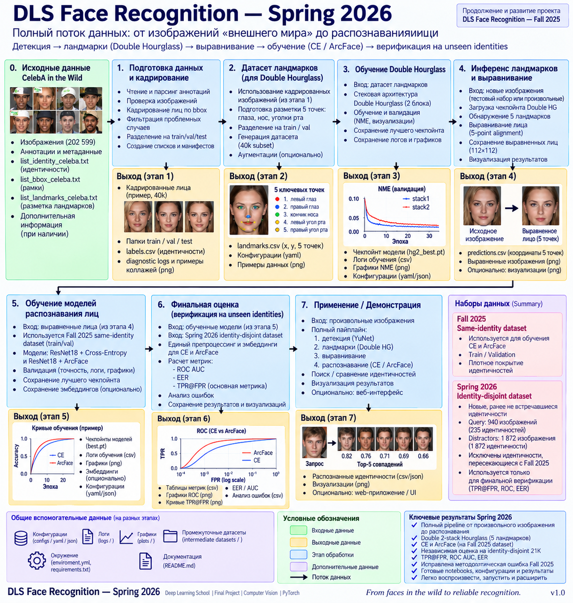

	# DLS Face Recognition --- Spring 2026

**Финальный проект Deep Learning School --- Face Recognition, Spring
2026**\
**Автор:** Andrei Bardin (Бардин Андрей)\
**Framework:** PyTorch\
**Основной dataset:** CelebA in the Wild

> Spring 2026 --- новая реализация face-recognition pipeline,
> развивающая идеи проекта Fall 2025.\
> Главные изменения: собственный modular front end
> `YuNet → Double Hourglass → 5-point alignment`, разделение training и
> final verification dataset contracts и корректная оценка
> unseen-identity verification через ROC / EER / TPR@FPR.

------------------------------------------------------------------------


## 1. Что это за проект

Цель Spring 2026 состояла не в том, чтобы ещё раз обучить classifier на
CelebA, а в том, чтобы собрать полный и контролируемый face-recognition
pipeline: от исходного изображения до face embedding и verification
decision.

Финальная архитектура:

``` text
Input image
    ↓
YuNet face detector
    ↓
Face bounding box
    ↓
Double 2-stack Hourglass
    ↓
5 facial landmarks
    ↓
5-point similarity alignment
    ↓
112 × 112 aligned RGB face
    ↓
Recognition
    ├── Cross-Entropy / ResNet18
    └── ArcFace / ResNet18
    ↓
512-D L2-normalized embedding
    ↓
Cosine similarity
    ↓
Face verification
```

В отличие от preprocessing, скрытого внутри крупной pretrained
face-recognition system, здесь detection, landmark localization и
alignment являются явными стадиями с собственными contracts, diagnostics
и artifacts.

------------------------------------------------------------------------

## 2. От Fall 2025 к Spring 2026

Spring 2026 связан с предыдущим проектом **DLS Face Recognition --- Fall
2025**, но не является простым продолжением старых notebooks.

Предыдущий репозиторий:

https://github.com/DrAndreyBardin/DLS_FR_2025_Fall

### Что было сделано в Fall 2025

Fall pipeline уже содержал полноценные recognition experiments:

-   Cross-Entropy baseline;
-   ArcFace;
-   Triplet Loss;
-   ArcFace + Triplet hybrid;
-   ResNet18 backbone;
-   512-D embeddings;
-   cosine-similarity-based recognition.

Поэтому Spring не повторяет Triplet Loss и ArcFace + Triplet. Это не
отказ от этих методов и не отрицательный результат: они уже были успешно
реализованы в Fall 2025. Повторять их означало бы дублировать
завершённую работу вместо исследования новых частей pipeline.

### Что принципиально изменено в Spring 2026

  -----------------------------------------------------------------------
  Компонент               Fall 2025               Spring 2026
  ----------------------- ----------------------- -----------------------
  Реализация              предыдущий pipeline     новый pipeline собран
                                                  заново

  Face front end          pretrained integrated   YuNet + Double
                          preprocessing           Hourglass + explicit
                                                  alignment

  Landmark model          не самостоятельная      Double 2-stack
                          обучаемая стадия        Hourglass, 5 landmarks
                          проекта                 

  Input                   в основном              CelebA Wild и arbitrary
                          подготовленные CelebA   images
                          faces                   

  CE / ArcFace            реализованы             сохранены как основные
                                                  recognition branches

  Triplet                 реализован              сознательно не
                                                  повторяется

  ArcFace + Triplet       реализован              сознательно не
                                                  повторяется

  Training protocol       same-identity split     same-identity split для
                                                  CE / ArcFace training

  Final verification      identities не были      frozen unseen-identity
                          достаточно отделены от  Spring benchmark
                          training population     

  Final metrics           предыдущий protocol     ROC-AUC, EER, TPR@FPR
  -----------------------------------------------------------------------

Самое существенное методологическое изменение --- не новый loss, а
**разделение задачи обучения classifier и задачи проверки generalization
на unseen identities**.

------------------------------------------------------------------------

## 3. Почему понадобились два dataset contracts

В Spring сначала был построен новый dataset примерно на 21K изображений
с identity-disjoint split.

Первоначальная идея была максимально строгой: разные identities для
разных subsets. Однако classification training требует другой
постановки. При попытке использовать identity-disjoint contract
непосредственно для CE / ArcFace classification не удалось получить
требуемую DLS accuracy `> 0.7`.

Это оказалось полезным отрицательным результатом, а не бесполезной
веткой.

### Training contract

Для обучения CE и ArcFace используется Fall-style dense same-identity
dataset:

``` text
same identities across train / validation / test
but different images of those identities
```

Он нужен для:

-   supervised classification training;
-   validation;
-   checkpoint selection;
-   выполнения DLS classification requirement.

### Evaluation contract

Spring 21K получил другую роль --- **unseen-identity verification
benchmark**.

``` text
Fall-style same-identity dataset
            ↓
      CE / ArcFace training
            ↓
      frozen checkpoints
            ↓
Spring identity-disjoint dataset
            ↓
remove identities overlapping Fall
            ↓
frozen Spring-only benchmark
            ↓
ROC / EER / TPR@FPR
```

Это исправляет важный недостаток Fall evaluation: population identities,
использованные для обучения recognition model, больше не должны
определять финальную verification quality.

Identity-disjoint structure нужна не для математического вычисления
TPR@FPR как такового, а для того, чтобы TPR@FPR характеризовал
generalization на **unseen identities**.

------------------------------------------------------------------------

## 4. Этапы pipeline и notebooks

Рекомендуемый порядок просмотра репозитория совпадает с dependency graph
конечной системы.

### Notebook 01 --- YuNet face detection

`notebooks/1.YuNet_BBox_Diagnostic_CelebA_Wild_v0_1__all.ipynb`

YuNet проверяется как отдельный lightweight detector на полном CelebA
Wild.

Ключевые результаты:

-   detection rate: **99.8667%**;
-   все 5 GT landmarks находятся внутри YuNet bbox для **99.3985%**
    успешных detections;
-   throughput: около **57.65 images/s**.

CelebA ground-truth landmarks здесь используются только как diagnostic
reference.

------------------------------------------------------------------------

### Notebook 02a --- подготовка 40K dataset для Hourglass

`notebooks/2a.celeba_40k_colab_export_separate_train_val.ipynb`

Создаёт identity-disjoint train/validation subset для обучения landmark
detector.

Этот dataset относится только к Hourglass training и не является
источником Spring 21K recognition benchmark.

Большие изображения не хранятся в Git: dataset воспроизводится из
исходного CelebA с помощью notebook и сохранённых manifests.

------------------------------------------------------------------------

### Notebook 02 --- Double 2-stack Hourglass

`notebooks/2.Double_2-stack_Hourglass_CelebA_5_Landmarks_v0_1.ipynb`

Основная landmark model проекта.

``` text
cropped face
    ↓
Stack 1
    ↓
intermediate supervision
    ↓
Stack 2
    ↓
5 landmark heatmaps
```

Final output берётся из Stack 2.

Canonical trained model:

-   2 stacks;
-   input: `256 × 256`;
-   heatmaps: `64 × 64`;
-   5 landmarks;
-   depth: 4;
-   channels: 256;
-   best NME: **0.0292557**.

До Double Hourglass был реализован Single Hourglass как проверка идеи.
Он остаётся историческим branch point, но не входит в final pipeline.

------------------------------------------------------------------------

### Notebook 03 --- Three-stage front end и Spring 21K

`notebooks/3.CelebA_Wild_21k_Three_Stage_Frontend_v0_1.ipynb`

Объединяет:

``` text
CelebA Wild
    ↓
YuNet
    ↓
Double Hourglass / Stack 2
    ↓
5 predicted landmarks
    ↓
Umeyama similarity transform
    ↓
112 × 112 RGB aligned faces
```

И формирует Spring 21K identity-disjoint dataset:

-   train: 16,000 images;
-   validation: 2,000;
-   test/query: 1,000;
-   test/distractors: 2,000.

40K Hourglass subset не используется как источник Spring 21K.

------------------------------------------------------------------------

### Notebook 04 --- Cross-Entropy

`notebooks/4.3_cross_entropy_loss_Fall2025_Spring2026_dual_dataset_remaster_v1__260827.ipynb`

Recognition baseline:

-   pretrained ResNet18;
-   512-D embedding;
-   Cross-Entropy classification;
-   21 epochs;
-   batch size 128;
-   AdamW;
-   Fall-style same-identity training contract.

Best epoch: **20**.

Classification:

-   Fall validation accuracy: **0.770504**;
-   Fall test accuracy: **0.770677**.

Таким образом, требование DLS `accuracy > 0.7` выполнено.

------------------------------------------------------------------------

### Notebook 05 --- ArcFace

`notebooks/5.4_additive_angular_margin_loss_Fall2025_dataset_remaster.ipynb`

Recognition branch:

-   pretrained ResNet18;
-   512-D embedding;
-   ArcFace additive angular margin;
-   `m = 0.25`;
-   `s = 64`;
-   margin warm-up;
-   21 epochs.

Canonical downstream checkpoint --- исходный `best.pt` (epoch 5).

Отдельно был заранее выбран full-margin epoch-15 reference checkpoint.
Несмотря на более высокую same-identity classification accuracy, он
оказался хуже `best.pt` на downstream unseen-identity verification.
Поэтому epoch 15 не заменяет canonical checkpoint.

Это важный практический результат: classification accuracy и ArcFace
training loss не следует автоматически интерпретировать как оптимальный
criterion для downstream verification checkpoint selection.

------------------------------------------------------------------------

### Notebook 06 --- Full face-recognition pipeline

`notebooks/6.DLS_FR_Task3_Full_Face_Recognition_Pipeline_v3_2__CelebA_500.ipynb`

Интеграционный notebook демонстрирует полный путь:

``` text
arbitrary image
    ↓
face detection
    ↓
landmarks
    ↓
alignment
    ↓
CE / ArcFace embeddings
    ↓
similarity / retrieval
```

Этот этап проверяет, что pipeline больше не зависит от CelebA
bbox/landmark annotations при inference.

------------------------------------------------------------------------

### Notebook 07 --- Frozen CE vs ArcFace verification

`notebooks/7.DLS_FR_CE_vs_ArcFace_TPR_FPR_Remastered_v1.ipynb`

Финальный benchmark.

Перед оценкой из Spring test population удаляются identities,
пересекающиеся с Fall training population.

Frozen Spring-only protocol:

-   query: **940 images / 235 identities**;
-   distractors: **1,872 images / 1,872 identities**;
-   genuine pairs: **1,410**;
-   impostor pairs: **2,199,600**.

Для обеих моделей используются одинаковые preprocessing, L2
normalization, cosine similarity и pair definitions.

------------------------------------------------------------------------

## 5. Финальные verification results

### Summary

  Metric      Cross-Entropy    ArcFace
  --------- --------------- ----------
  ROC-AUC      **0.952670**   0.930289
  EER          **0.116379**   0.145390

### TPR at fixed FPR

       FPR   Cross-Entropy    ArcFace
  -------- --------------- ----------
       0.5    **0.984397**   0.975177
       0.2    **0.929078**   0.902128
       0.1    **0.867376**   0.788652
      0.05    **0.797163**   0.682270
      0.01    **0.589362**   0.438298
     0.001    **0.299291**   0.192908
    0.0001    **0.127660**   0.071631

В данном frozen experiment CE checkpoint превосходит canonical ArcFace
checkpoint.

Это **не утверждение о фундаментальном превосходстве Cross-Entropy над
ArcFace**. Это результат конкретных checkpoints, training setup, dataset
и frozen evaluation protocol.

Именно поэтому результаты сохраняются вместе с protocol artifacts, а не
интерпретируются вне контекста эксперимента.

------------------------------------------------------------------------

## 6. Почему TPR@FPR является важной финальной метрикой

Classification accuracy отвечает на вопрос: насколько хорошо classifier
различает классы в заданной identity population.

Face verification задаёт другой вопрос:

> Насколько часто система правильно принимает genuine pair при заранее
> ограниченной допустимой частоте false accepts?

Поэтому для verification важны operating points:

-   `TPR @ FPR = 1e-2`;
-   `TPR @ FPR = 1e-3`;
-   `TPR @ FPR = 1e-4`.

Spring 2026 сознательно заканчивается не только classification accuracy,
а frozen verification experiment на unseen identities.

------------------------------------------------------------------------

## 7. Структура репозитория

В public repository сохраняются notebooks, компактные dataset manifests,
experiment artifacts и документация. Большие производные CelebA image
datasets не дублируются в Git.

``` text
DLS_FR_Spring_2026/
├── README.md
├── notebooks/
│   ├── 1.YuNet_BBox_Diagnostic_CelebA_Wild_v0_1__all.ipynb
│   ├── 2.Double_2-stack_Hourglass_CelebA_5_Landmarks_v0_1.ipynb
│   ├── 2a.celeba_40k_colab_export_separate_train_val.ipynb
│   ├── 3.CelebA_Wild_21k_Three_Stage_Frontend_v0_1.ipynb
│   ├── 4.3_cross_entropy_loss_Fall2025_Spring2026_dual_dataset_remaster_v1__260827.ipynb
│   ├── 5.4_additive_angular_margin_loss_Fall2025_dataset_remaster.ipynb
│   ├── 6.DLS_FR_Task3_Full_Face_Recognition_Pipeline_v3_2__CelebA_500.ipynb
│   └── 7.DLS_FR_CE_vs_ArcFace_TPR_FPR_Remastered_v1.ipynb
├── dataset/
│   ├── 2a.hourglass_40k_TVsplit/
│   └── 3.celeba_21k_aligned/
├── output/
│   ├── 1.yunet_bbox_diagnostic_celeba_wild_v0_1__all/
│   ├── 2.double_hourglass_runs/
│   ├── 4.ce_resnet18_dual_Fall2025_Spring2026_ep21_v1/
│   ├── 5.arcface_resnet18_legacyFall2025_sameidval_ep21_ref15_fr10_m0p25/
│   ├── 6.dls_fr_task3_output_v32_500/
│   └── 7.ce_vs_arcface_tpr_fpr_results/
└── external_assets/
    ├── README.md
    └── manifest.csv
```

Исторические имена файлов сохранены там, где их переименование не даёт
существенного выигрыша и может затруднить сопоставление с исходными
experiments.

------------------------------------------------------------------------

## 8. Данные и external assets

Исходные и производные CelebA image datasets не являются частью Git
history.

В repository остаются:

-   directory structure;
-   compact manifests;
-   validation reports;
-   один небольшой naming example там, где это полезно;
-   notebooks, позволяющие воспроизвести preprocessing.

Canonical trained checkpoints также не помещаются непосредственно в Git.
Для них предусмотрено внешнее хранение и единый registry:

`external_assets/manifest.csv`

Canonical checkpoints:

1.  Double 2-stack Hourglass;
2.  Cross-Entropy ResNet18;
3.  ArcFace ResNet18.

Таким образом, Git repository содержит reproducibility record, а не
копию всех локальных intermediate data.

------------------------------------------------------------------------

## 9. Как смотреть проект преподавателю

Если цель --- быстро проверить содержательную часть проекта,
рекомендуется следующий маршрут:

``` text
README
  ↓
01 YuNet
  ↓
02 Double Hourglass
  ↓
03 Three-stage front end / 21K
  ↓
04 Cross-Entropy
  ↓
05 ArcFace
  ↓
06 Full pipeline
  ↓
07 Final TPR@FPR benchmark
```

Notebook `02a` следует рассматривать как data-preparation dependency для
Hourglass, а не как отдельный ML experiment.

Особенно важны:

-   Notebook 02 --- собственная landmark model;
-   Notebook 03 --- интеграция нового front end;
-   Notebooks 04--05 --- recognition training;
-   Notebook 06 --- end-to-end inference;
-   Notebook 07 --- финальный identity-disjoint verification protocol.

------------------------------------------------------------------------

## 10. Что можно неправильно понять

### Почему Spring 21K не используется для CE / ArcFace training?

Потому что identity-disjoint dataset решает другую задачу. Попытка
использовать его как classification training contract не дала требуемой
DLS accuracy. Он был сохранён как более корректный unseen-identity
verification benchmark.

### Почему в Spring нет Triplet Loss и ArcFace + Triplet?

Они уже успешно реализованы в Fall 2025. Spring не повторяет завершённые
experiments.

### Почему final ArcFace checkpoint --- epoch 5, хотя epoch 15 имеет более высокую same-identity accuracy?

Потому что downstream verification на frozen unseen identities оказался
лучше для исходного `best.pt`. Epoch 15 был проверен как predefined
control и не заменил canonical checkpoint.

### Почему CE оказался лучше ArcFace?

Таков результат именно данного frozen experiment. Он не превращается в
общий вывод о loss functions.

### Почему datasets не лежат целиком в Git?

Потому что они воспроизводимы из CelebA с помощью notebooks и manifests,
а Git repository не должен превращаться в хранилище гигабайт производных
изображений.

------------------------------------------------------------------------

## 11. Итог

Spring 2026 оказался не просто расширением Fall 2025 ещё одним loss
function.

Основной результат проекта --- переход от recognition experiment к более
полной инженерной системе:

``` text
wild image
   ↓
explicit face front end
   ↓
aligned canonical face
   ↓
recognition embedding
   ↓
verification on unseen identities
```

Наиболее важным уроком стала необходимость разделять три разных вопроса:

1.  способен ли classifier обучиться различать training identity
    population;
2.  способен ли pipeline получить корректный embedding из исходного wild
    image;
3.  насколько хорошо этот embedding работает при verification людей,
    которых recognition model не видела при обучении.

Именно это разделение определило архитектуру Spring 2026: отдельный
Hourglass training dataset, same-identity recognition training contract
и identity-disjoint final verification benchmark.

------------------------------------------------------------------------

## 12. Status

**Spring 2026 v1.0 --- publication candidate.**

Текущий repository содержит final notebooks, selected experiment
artifacts и reproducibility metadata. Canonical model checkpoints
публикуются отдельно как external assets.

Дальнейшие изменения, если они понадобятся, рассматриваются как
последующие revisions, а не как условие завершения первой публичной
версии.
