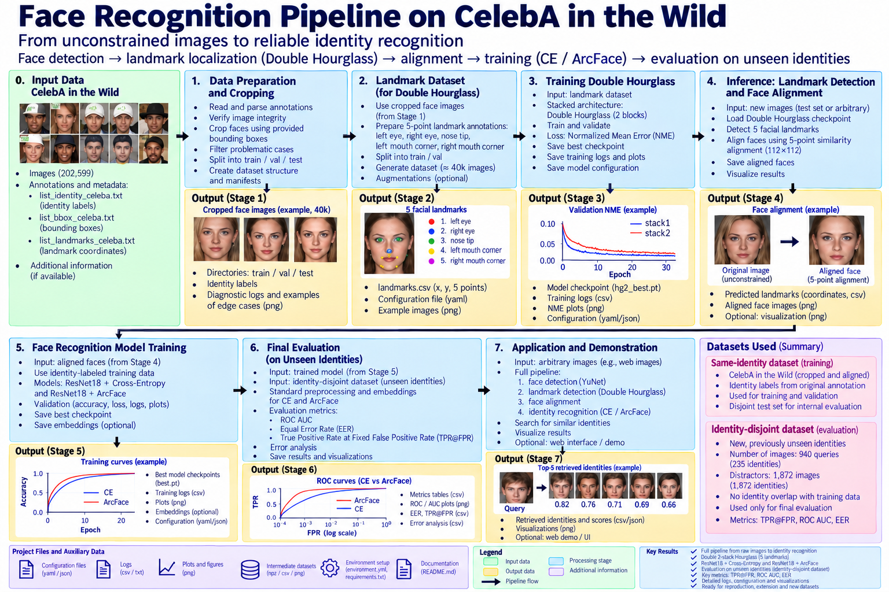

# Face Recognition Pipeline — CelebA in the Wild

**Author:** Andrei Bardin  
**Framework:** PyTorch  
**Primary dataset:** CelebA in the Wild

> An end-to-end face-recognition pipeline built as a modular research and engineering project.
> The system explicitly separates face detection, landmark localization, geometric alignment,
> representation learning, and verification. Its final evaluation uses identities excluded
> from the recognition-model training population.

---



## 1. Project Overview

The objective of this project is not merely to train a classifier on CelebA, but to construct
and evaluate a complete, controlled face-recognition pipeline: from an unconstrained input
image to a face embedding and a verification decision.

The final architecture is:

```text
Input image
    ↓
YuNet face detector
    ↓
Face bounding box
    ↓
Double 2-stack Hourglass
    ↓
5 facial landmarks
    ↓
5-point similarity alignment
    ↓
112 × 112 aligned RGB face
    ↓
Recognition
    ├── Cross-Entropy / ResNet18
    └── ArcFace / ResNet18
    ↓
512-D L2-normalized embedding
    ↓
Cosine similarity
    ↓
Face verification
```

Rather than hiding preprocessing inside a large pretrained face-recognition system, this
implementation treats detection, landmark localization, and alignment as explicit,
independently testable stages with their own interfaces, diagnostics, checkpoints, and
reproducibility artifacts.

The project therefore addresses three distinct questions:

1. Can the recognition model learn discriminative representations for its training identity population?
2. Can the complete front end reliably transform unconstrained images into canonical aligned faces?
3. Do the resulting embeddings generalize to verification of identities never observed during recognition training?

---

## 2. Experimental Design

The project combines two recognition branches with a custom modular front end:

| Component | Implementation |
|---|---|
| Face detection | YuNet |
| Landmark localization | Double 2-stack Hourglass, 5 landmarks |
| Alignment | 5-point similarity transform |
| Recognition backbone | ResNet18 |
| Recognition objectives | Cross-Entropy and ArcFace |
| Embedding | 512-D, L2-normalized |
| Similarity | Cosine similarity |
| Final evaluation | Identity-disjoint verification |
| Verification metrics | ROC-AUC, EER, TPR@FPR |

Earlier experiments also included Triplet Loss and a combined ArcFace + Triplet objective.
Those branches are not repeated here because the present work focuses on the explicit
front end, end-to-end integration, and a stricter verification protocol.

The central methodological choice is to separate **recognition-model training** from
**generalization testing on unseen identities**.

---

## 3. Dataset Contracts

A key result of the project was recognizing that classification training and identity-disjoint
verification require different dataset contracts.

An identity-disjoint dataset of approximately 21,000 images was initially constructed with
the intention of using disjoint identities across subsets. In practice, applying that contract
directly to supervised CE / ArcFace classification did not produce the required classification
performance. Rather than discarding the dataset, its role was redefined according to the
statistical question it was better suited to answer.

### 3.1 Recognition-training contract

Cross-Entropy and ArcFace are trained using a dense same-identity dataset:

```text
same identities represented across train / validation / test
but with different images of those identities
```

This contract supports:

- supervised identity classification;
- validation during optimization;
- checkpoint selection;
- controlled comparison of recognition objectives.

### 3.2 Verification contract

The separate identity-disjoint dataset is used as a frozen **unseen-identity verification benchmark**:

```text
same-identity recognition dataset
            ↓
      CE / ArcFace training
            ↓
      frozen checkpoints
            ↓
identity-disjoint evaluation dataset
            ↓
remove identities overlapping training population
            ↓
frozen unseen-identity benchmark
            ↓
ROC / EER / TPR@FPR
```

The identity-disjoint structure is not required mathematically to compute TPR@FPR. Its purpose
is experimental: it ensures that the reported verification operating points measure
generalization to identities unseen during recognition-model training.

---

## 4. Pipeline Stages and Notebooks

The recommended reading order follows the dependency graph of the final system.

### Notebook 01 — YuNet Face Detection

`notebooks/1.YuNet_BBox_Diagnostic_CelebA_Wild_v0_1__all.ipynb`

YuNet is evaluated independently as a lightweight detector on the complete CelebA Wild dataset.

Key results:

- detection rate: **99.8667%**;
- all five ground-truth landmarks lie inside the YuNet bounding box for **99.3985%**
  of successful detections;
- throughput: approximately **57.65 images/s**.

CelebA ground-truth landmarks are used here only as a diagnostic reference.

---

### Notebook 02a — 40K Landmark Dataset Preparation

`notebooks/2a.celeba_40k_colab_export_separate_train_val.ipynb`

Constructs the train/validation subset used to train the landmark detector.

This dataset is specific to Hourglass training and is not the source of the final
identity-disjoint recognition benchmark.

Large derived image datasets are not stored in Git. They can be regenerated from the
original CelebA data using the notebook and preserved manifests.

---

### Notebook 02 — Double 2-stack Hourglass

`notebooks/2.Double_2-stack_Hourglass_CelebA_5_Landmarks_v0_1.ipynb`

This notebook implements the project's trainable facial-landmark model:

```text
cropped face
    ↓
Stack 1
    ↓
intermediate supervision
    ↓
Stack 2
    ↓
5 landmark heatmaps
```

The final landmark prediction is taken from Stack 2.

Canonical trained model:

- 2 stacks;
- input resolution: `256 × 256`;
- heatmaps: `64 × 64`;
- 5 facial landmarks;
- Hourglass depth: 4;
- 256 channels;
- best Normalized Mean Error (NME): **0.0292557**.

A Single Hourglass model was implemented first as a proof of concept. It remains part of
the experimental history but is not used in the final pipeline.

---

### Notebook 03 — Three-stage Front End and Identity-disjoint Dataset

`notebooks/3.CelebA_Wild_21k_Three_Stage_Frontend_v0_1.ipynb`

Integrates the complete image-normalization front end:

```text
CelebA Wild
    ↓
YuNet
    ↓
Double Hourglass / Stack 2
    ↓
5 predicted landmarks
    ↓
Umeyama similarity transform
    ↓
112 × 112 RGB aligned faces
```

It also constructs the approximately 21K identity-disjoint dataset:

- train: 16,000 images;
- validation: 2,000 images;
- test/query: 1,000 images;
- test/distractors: 2,000 images.

The 40K Hourglass subset is not used as the source of this dataset.

---

### Notebook 04 — Cross-Entropy Recognition

`notebooks/4.3_cross_entropy_loss_Fall2025_Spring2026_dual_dataset_remaster_v1__260827.ipynb`

Recognition baseline:

- pretrained ResNet18;
- 512-D embedding;
- Cross-Entropy classification;
- 21 epochs;
- batch size 128;
- AdamW optimizer;
- dense same-identity training contract.

Best epoch: **20**.

Classification results:

- validation accuracy: **0.770504**;
- test accuracy: **0.770677**.

---

### Notebook 05 — ArcFace Recognition

`notebooks/5.4_additive_angular_margin_loss_Fall2025_dataset_remaster.ipynb`

Recognition branch:

- pretrained ResNet18;
- 512-D embedding;
- ArcFace additive angular margin;
- `m = 0.25`;
- `s = 64`;
- margin warm-up;
- 21 epochs.

The canonical downstream checkpoint is the original `best.pt` from epoch 5.

A predefined full-margin epoch-15 checkpoint was subsequently evaluated as a post-hoc control.
Although it achieved higher same-identity classification accuracy, its downstream verification
performance was worse than that of the canonical `best.pt`.

No checkpoint sweep against the frozen verification benchmark was performed. The epoch-15
model therefore remains a documented control rather than a replacement selected retrospectively
on the final test protocol.

This experiment illustrates an important practical point: classification accuracy and ArcFace
training loss should not automatically be treated as optimal criteria for downstream
verification checkpoint selection.

---

### Notebook 06 — Full Face-recognition Pipeline

`notebooks/6.DLS_FR_Task3_Full_Face_Recognition_Pipeline_v3_2__CelebA_500.ipynb`

Integration notebook demonstrating the complete inference path:

```text
arbitrary image
    ↓
face detection
    ↓
landmark localization
    ↓
alignment
    ↓
CE / ArcFace embeddings
    ↓
similarity / retrieval
```

At inference time, the pipeline no longer depends on CelebA bounding-box or landmark annotations.

---

### Notebook 07 — Frozen CE vs ArcFace Verification

`notebooks/7.DLS_FR_CE_vs_ArcFace_TPR_FPR_Remastered_v1.ipynb`

Final verification benchmark.

Before evaluation, identities overlapping the recognition-training population are removed from
the evaluation population.

Frozen unseen-identity protocol:

- query: **940 images / 235 identities**;
- distractors: **1,872 images / 1,872 identities**;
- genuine pairs: **1,410**;
- impostor pairs: **2,199,600**.

Both models use identical preprocessing, L2 normalization, cosine similarity, and pair definitions.

---

## 5. Final Verification Results

### Summary

| Metric | Cross-Entropy | ArcFace |
|---|---:|---:|
| ROC-AUC | **0.952670** | 0.930289 |
| EER | **0.116379** | 0.145390 |

### TPR at Fixed FPR

| FPR | Cross-Entropy | ArcFace |
|---:|---:|---:|
| 0.5 | **0.984397** | 0.975177 |
| 0.2 | **0.929078** | 0.902128 |
| 0.1 | **0.867376** | 0.788652 |
| 0.05 | **0.797163** | 0.682270 |
| 0.01 | **0.589362** | 0.438298 |
| 0.001 | **0.299291** | 0.192908 |
| 0.0001 | **0.127660** | 0.071631 |

In this frozen experiment, the Cross-Entropy checkpoint outperforms the canonical ArcFace
checkpoint.

This result should **not** be interpreted as evidence that Cross-Entropy is intrinsically
superior to ArcFace. It applies to these particular checkpoints, training conditions, datasets,
and the specified frozen evaluation protocol.

For that reason, numerical results are preserved together with the protocol artifacts needed
to interpret and reproduce them.

---

## 6. Why TPR@FPR Is a Central Evaluation Metric

Classification accuracy asks how effectively a classifier separates a predefined identity
population.

Face verification asks a different operational question:

> At a specified acceptable false-accept rate, how often does the system correctly accept a
> genuine pair?

The project therefore reports verification performance at fixed operating points, including:

- `TPR @ FPR = 1e-2`;
- `TPR @ FPR = 1e-3`;
- `TPR @ FPR = 1e-4`.

The final experiment deliberately goes beyond closed-population classification accuracy and
evaluates verification on identities not observed during recognition-model training.

---

## 7. Repository Structure

The public repository contains notebooks, compact dataset manifests, experiment artifacts,
and documentation. Large derived CelebA image datasets are intentionally excluded from Git.

```text
DLS_FR_Spring_2026/
├── README.md
├── pipeline_dataflow.png
├── .gitignore
├── notebooks/
│   ├── 1.YuNet_BBox_Diagnostic_CelebA_Wild_v0_1__all.ipynb
│   ├── 2.Double_2-stack_Hourglass_CelebA_5_Landmarks_v0_1.ipynb
│   ├── 2a.celeba_40k_colab_export_separate_train_val.ipynb
│   ├── 3.CelebA_Wild_21k_Three_Stage_Frontend_v0_1.ipynb
│   ├── 4.3_cross_entropy_loss_Fall2025_Spring2026_dual_dataset_remaster_v1__260827.ipynb
│   ├── 5.4_additive_angular_margin_loss_Fall2025_dataset_remaster.ipynb
│   ├── 6.DLS_FR_Task3_Full_Face_Recognition_Pipeline_v3_2__CelebA_500.ipynb
│   └── 7.DLS_FR_CE_vs_ArcFace_TPR_FPR_Remastered_v1.ipynb
├── dataset/
│   ├── 2a.hourglass_40k_TVsplit/
│   └── 3.celeba_21k_aligned/
├── output/
│   ├── 1.yunet_bbox_diagnostic_celeba_wild_v0_1__all/
│   ├── 2.double_hourglass_runs/
│   ├── 4.ce_resnet18_dual_Fall2025_Spring2026_ep21_v1/
│   ├── 5.arcface_resnet18_legacyFall2025_sameidval_ep21_ref15_fr10_m0p25/
│   ├── 6.dls_fr_task3_output_v32_500/
│   └── 7.ce_vs_arcface_tpr_fpr_results/
└── external_assets/
    ├── README.md
    └── manifest.csv
```

Some historical filenames have been retained to preserve traceability between notebooks,
experiment outputs, and checkpoints. They should not be interpreted as part of the conceptual
architecture of the project.

---

## 8. Data and External Assets

Original and derived CelebA image datasets are not stored in the Git history.

The repository retains:

- directory structure;
- compact manifests;
- validation reports;
- small representative examples where useful;
- notebooks required to reproduce preprocessing;
- experiment metadata and diagnostics.

Canonical trained checkpoints are distributed through GitHub Release `v1.0.0` rather than
stored directly in Git history.

`external_assets/manifest.csv` serves as the authoritative registry for release-asset locations,
SHA-256 checksums, and distribution status.

Canonical checkpoints:

1. Double 2-stack Hourglass — `double_hourglass_2stack_best.pt`;
2. Cross-Entropy ResNet18 — `ce_resnet18_best.pt`;
3. ArcFace ResNet18 — `arcface_resnet18_best.pt`.

The repository is therefore designed as a reproducibility record rather than a duplicate store
of all locally generated intermediate data.

---

## 9. Suggested Reading Path

For a rapid technical review, the following sequence follows the architecture of the system:

```text
README
  ↓
01 YuNet detection
  ↓
02 Double Hourglass
  ↓
03 Three-stage front end / identity-disjoint dataset
  ↓
04 Cross-Entropy
  ↓
05 ArcFace
  ↓
06 End-to-end inference
  ↓
07 Frozen TPR@FPR verification benchmark
```

Notebook `02a` is a data-preparation dependency for Hourglass training rather than an independent
machine-learning experiment.

The most technically significant stages are:

- **Notebook 02** — trainable facial-landmark localization;
- **Notebook 03** — integration of detection, learned landmarks, and geometric alignment;
- **Notebooks 04–05** — recognition-model training;
- **Notebook 06** — end-to-end inference from arbitrary images;
- **Notebook 07** — frozen identity-disjoint verification protocol.

---

## 10. Methodological Notes

### Why is the identity-disjoint dataset not used directly for CE / ArcFace training?

Because the two datasets serve different experimental purposes. The identity-disjoint contract
is designed to test generalization to previously unseen identities, whereas supervised
classification requires repeated observations of the identities whose class boundaries are
being learned.

The attempted identity-disjoint classification formulation was retained as an informative
negative result, and the dataset was repurposed as the stricter verification benchmark.

### Why are Triplet Loss and ArcFace + Triplet not part of the main pipeline?

Both objectives had already been implemented and tested in earlier experiments. Repeating them
would add limited information to the present study, whose main contribution is the explicit
front end and the separation between recognition training and unseen-identity verification.

### Why is the canonical ArcFace checkpoint from epoch 5 rather than the epoch-15 model with higher classification accuracy?

Because the predefined epoch-15 control produced worse downstream verification performance.
It was evaluated as a post-hoc control only; the final benchmark was not used for an iterative
checkpoint search.

### Why does Cross-Entropy outperform ArcFace in the reported benchmark?

That is the empirical result for the specific frozen models and protocol reported here. It is
not a general conclusion about the two loss functions.

### Why are the complete datasets not stored in Git?

The derived datasets can be regenerated from CelebA using the notebooks and manifests. Keeping
gigabytes of reproducible image derivatives in Git would reduce repository usability without
improving experimental traceability.

---

## 11. Main Outcome

The main result of the project is the transition from an isolated recognition experiment to a
modular end-to-end system:

```text
unconstrained image
   ↓
explicit face front end
   ↓
canonical aligned face
   ↓
recognition embedding
   ↓
verification on unseen identities
```

The most important methodological conclusion is that three questions should remain separate:

1. whether a classifier can distinguish identities represented during supervised training;
2. whether the image-processing front end can produce a stable canonical face from an
   unconstrained image;
3. whether the resulting representation supports verification of people unseen during
   recognition-model training.

This distinction motivated the final architecture: a dedicated landmark-training dataset,
a dense recognition-training contract, and a separate identity-disjoint verification benchmark.

---

## 12. Project Status

**Version 1.0 — publication-ready research repository.**

The repository contains the final notebooks, selected experiment artifacts, reproducibility
metadata, and released canonical model checkpoints.

The current revision is intended as a stable public version. Future experiments or architectural
changes should be treated as subsequent revisions rather than prerequisites for reproducing
the results reported here.
